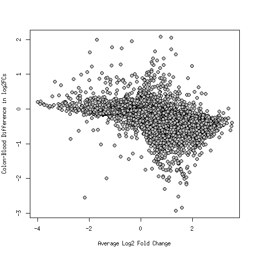

```
## Error in citation("BiocStyle"): package 'BiocStyle' not found
```

```
## Error in write.bibtex(bibs, file = "gtex_analysis.bib"): object 'bibs' not found
```

```
## Error in ReadBib(file, .Encoding = .Encoding, header = NULL, footer = NULL, : unable to open file to read
```

```
## Error in eval(expr, envir, enclos): object 'bibs' not found
```

# Overview

This document compares GTEx data release v6 to Recount.  The main issue addressed in this document is mapping up genes and samples between the two datasets.  The annotations are different:

- GTEx uses Gencode v19 mapped to hg19.
- Recount uses UCSC knownGene as represented by the `TxDb.Hsapiens.UCSC.hg38.knownGene` package, mapped to hg38.

# Dependencies

## R packages


```r
library('ballgown')
library('coop')
library('org.Hs.eg.db')
library('readr')
library('recount')
library('rtracklayer')
library('stringr')
library('SummarizedExperiment')
library('limma')
library('edgeR')
```

## Data objects

### From Recount

### From GTEx website

We have downloaded the annotation GTF files as well as the raw gene count matrix from the [GTEx portal](http://www.gtexportal.org).


```r
dataPath <- "/dcs01/ajaffe/GTEX/V6" # wherever data was downloaded
gtexGtf <- import(file.path(dataPath, "gencode.v19.genes.patched_contigs.gtf"))
```

```
## Found more than one class "connection" in cache; using the first, from namespace 'BiocGenerics'
## Found more than one class "connection" in cache; using the first, from namespace 'BiocGenerics'
## Found more than one class "connection" in cache; using the first, from namespace 'BiocGenerics'
```

```r
gtexData <- read_tsv(file.path(dataPath,
    "GTEx_Analysis_v6_RNA-seq_RNA-SeQCv1.1.8_gene_reads.gct.gz"), skip=2)
```

```
## 
|                                                                               |   0%           
|                                                                               |   0%           
|                                                                               |   0%    1 MB
|                                                                               |   0%    2 MB
|                                                                               |   0%    2 MB
|                                                                               |   0%    3 MB
|                                                                               |   0%    4 MB
|                                                                               |   0%    5 MB
|                                                                               |   0%    6 MB
|                                                                               |   0%    6 MB
|                                                                               |   0%    7 MB
|                                                                               |   0%    8 MB
|                                                                               |   0%    8 MB
|                                                                               |   0%    9 MB
|                                                                               |   0%   10 MB
|                                                                               |   0%   10 MB
|                                                                               |   0%   11 MB
|                                                                               |   0%   12 MB
|                                                                               |   1%   12 MB
|                                                                               |   1%   13 MB
|                                                                               |   1%   14 MB
|                                                                               |   1%   14 MB
|                                                                               |   1%   15 MB
|=                                                                              |   1%   16 MB
|=                                                                              |   1%   17 MB
|=                                                                              |   1%   17 MB
|=                                                                              |   1%   18 MB
|=                                                                              |   1%   19 MB
|=                                                                              |   1%   19 MB
|=                                                                              |   1%   20 MB
|=                                                                              |   1%   21 MB
|=                                                                              |   1%   22 MB
|=                                                                              |   1%   22 MB
|=                                                                              |   1%   23 MB
|=                                                                              |   1%   24 MB
|=                                                                              |   1%   25 MB
|=                                                                              |   2%   25 MB
|=                                                                              |   2%   26 MB
|=                                                                              |   2%   27 MB
|=                                                                              |   2%   28 MB
|=                                                                              |   2%   28 MB
|=                                                                              |   2%   29 MB
|=                                                                              |   2%   30 MB
|=                                                                              |   2%   31 MB
|==                                                                             |   2%   31 MB
|==                                                                             |   2%   32 MB
|==                                                                             |   2%   33 MB
|==                                                                             |   2%   34 MB
|==                                                                             |   2%   34 MB
|==                                                                             |   2%   35 MB
|==                                                                             |   2%   36 MB
|==                                                                             |   2%   36 MB
|==                                                                             |   2%   37 MB
|==                                                                             |   3%   38 MB
|==                                                                             |   3%   38 MB
|==                                                                             |   3%   39 MB
|==                                                                             |   3%   40 MB
|==                                                                             |   3%   40 MB
|==                                                                             |   3%   41 MB
|==                                                                             |   3%   42 MB
|==                                                                             |   3%   42 MB
|==                                                                             |   3%   43 MB
|==                                                                             |   3%   43 MB
|==                                                                             |   3%   44 MB
|==                                                                             |   3%   45 MB
|==                                                                             |   3%   45 MB
|==                                                                             |   3%   46 MB
|==                                                                             |   3%   47 MB
|===                                                                            |   3%   47 MB
|===                                                                            |   3%   48 MB
|===                                                                            |   3%   48 MB
|===                                                                            |   3%   49 MB
|===                                                                            |   3%   50 MB
|===                                                                            |   4%   51 MB
|===                                                                            |   4%   51 MB
|===                                                                            |   4%   52 MB
|===                                                                            |   4%   53 MB
|===                                                                            |   4%   53 MB
|===                                                                            |   4%   54 MB
|===                                                                            |   4%   54 MB
|===                                                                            |   4%   55 MB
|===                                                                            |   4%   56 MB
|===                                                                            |   4%   56 MB
|===                                                                            |   4%   57 MB
|===                                                                            |   4%   58 MB
|===                                                                            |   4%   59 MB
|===                                                                            |   4%   59 MB
|===                                                                            |   4%   60 MB
|===                                                                            |   4%   61 MB
|===                                                                            |   4%   62 MB
|===                                                                            |   4%   62 MB
|===                                                                            |   4%   63 MB
|====                                                                           |   5%   63 MB
|====                                                                           |   5%   64 MB
|====                                                                           |   5%   65 MB
|====                                                                           |   5%   65 MB
|====                                                                           |   5%   66 MB
|====                                                                           |   5%   67 MB
|====                                                                           |   5%   67 MB
|====                                                                           |   5%   68 MB
|====                                                                           |   5%   68 MB
|====                                                                           |   5%   69 MB
|====                                                                           |   5%   70 MB
|====                                                                           |   5%   70 MB
|====                                                                           |   5%   71 MB
|====                                                                           |   5%   72 MB
|====                                                                           |   5%   73 MB
|====                                                                           |   5%   73 MB
|====                                                                           |   5%   74 MB
|====                                                                           |   5%   75 MB
|====                                                                           |   5%   75 MB
|====                                                                           |   6%   76 MB
|====                                                                           |   6%   77 MB
|====                                                                           |   6%   78 MB
|====                                                                           |   6%   79 MB
|=====                                                                          |   6%   80 MB
|=====                                                                          |   6%   80 MB
|=====                                                                          |   6%   81 MB
|=====                                                                          |   6%   81 MB
|=====                                                                          |   6%   82 MB
|=====                                                                          |   6%   83 MB
|=====                                                                          |   6%   83 MB
|=====                                                                          |   6%   84 MB
|=====                                                                          |   6%   85 MB
|=====                                                                          |   6%   86 MB
|=====                                                                          |   6%   86 MB
|=====                                                                          |   6%   87 MB
|=====                                                                          |   6%   88 MB
|=====                                                                          |   6%   88 MB
|=====                                                                          |   7%   89 MB
|=====                                                                          |   7%   90 MB
|=====                                                                          |   7%   90 MB
|=====                                                                          |   7%   91 MB
|=====                                                                          |   7%   91 MB
|=====                                                                          |   7%   92 MB
|=====                                                                          |   7%   93 MB
|=====                                                                          |   7%   93 MB
|=====                                                                          |   7%   94 MB
|=====                                                                          |   7%   95 MB
|======                                                                         |   7%   95 MB
|======                                                                         |   7%   96 MB
|======                                                                         |   7%   96 MB
|======                                                                         |   7%   97 MB
|======                                                                         |   7%   98 MB
|======                                                                         |   7%   98 MB
|======                                                                         |   7%   99 MB
|======                                                                         |   7%  100 MB
|======                                                                         |   7%  100 MB
|======                                                                         |   8%  101 MB
|======                                                                         |   8%  102 MB
|======                                                                         |   8%  103 MB
|======                                                                         |   8%  103 MB
|======                                                                         |   8%  104 MB
|======                                                                         |   8%  105 MB
|======                                                                         |   8%  105 MB
|======                                                                         |   8%  106 MB
|======                                                                         |   8%  107 MB
|======                                                                         |   8%  107 MB
|======                                                                         |   8%  108 MB
|======                                                                         |   8%  108 MB
|======                                                                         |   8%  109 MB
|======                                                                         |   8%  110 MB
|======                                                                         |   8%  111 MB
|=======                                                                        |   8%  111 MB
|=======                                                                        |   8%  112 MB
|=======                                                                        |   8%  113 MB
|=======                                                                        |   8%  113 MB
|=======                                                                        |   9%  114 MB
|=======                                                                        |   9%  115 MB
|=======                                                                        |   9%  115 MB
|=======                                                                        |   9%  116 MB
|=======                                                                        |   9%  117 MB
|=======                                                                        |   9%  117 MB
|=======                                                                        |   9%  118 MB
|=======                                                                        |   9%  118 MB
|=======                                                                        |   9%  119 MB
|=======                                                                        |   9%  120 MB
|=======                                                                        |   9%  120 MB
|=======                                                                        |   9%  121 MB
|=======                                                                        |   9%  121 MB
|=======                                                                        |   9%  122 MB
|=======                                                                        |   9%  122 MB
|=======                                                                        |   9%  123 MB
|=======                                                                        |   9%  124 MB
|=======                                                                        |   9%  124 MB
|=======                                                                        |   9%  125 MB
|=======                                                                        |   9%  126 MB
|=======                                                                        |   9%  126 MB
|========                                                                       |  10%  127 MB
|========                                                                       |  10%  127 MB
|========                                                                       |  10%  128 MB
|========                                                                       |  10%  129 MB
|========                                                                       |  10%  129 MB
|========                                                                       |  10%  130 MB
|========                                                                       |  10%  131 MB
|========                                                                       |  10%  131 MB
|========                                                                       |  10%  132 MB
|========                                                                       |  10%  133 MB
|========                                                                       |  10%  134 MB
|========                                                                       |  10%  134 MB
|========                                                                       |  10%  135 MB
|========                                                                       |  10%  136 MB
|========                                                                       |  10%  136 MB
|========                                                                       |  10%  137 MB
|========                                                                       |  10%  138 MB
|========                                                                       |  10%  138 MB
|========                                                                       |  10%  139 MB
|========                                                                       |  11%  140 MB
|========                                                                       |  11%  140 MB
|========                                                                       |  11%  141 MB
|========                                                                       |  11%  142 MB
|========                                                                       |  11%  142 MB
|=========                                                                      |  11%  143 MB
|=========                                                                      |  11%  144 MB
|=========                                                                      |  11%  144 MB
|=========                                                                      |  11%  145 MB
|=========                                                                      |  11%  145 MB
|=========                                                                      |  11%  146 MB
|=========                                                                      |  11%  147 MB
|=========                                                                      |  11%  147 MB
|=========                                                                      |  11%  148 MB
|=========                                                                      |  11%  149 MB
|=========                                                                      |  11%  150 MB
|=========                                                                      |  11%  150 MB
|=========                                                                      |  11%  151 MB
|=========                                                                      |  11%  152 MB
|=========                                                                      |  12%  152 MB
|=========                                                                      |  12%  153 MB
|=========                                                                      |  12%  154 MB
|=========                                                                      |  12%  154 MB
|=========                                                                      |  12%  155 MB
|=========                                                                      |  12%  155 MB
|=========                                                                      |  12%  156 MB
|=========                                                                      |  12%  156 MB
|=========                                                                      |  12%  157 MB
|=========                                                                      |  12%  158 MB
|=========                                                                      |  12%  158 MB
|==========                                                                     |  12%  159 MB
|==========                                                                     |  12%  160 MB
|==========                                                                     |  12%  160 MB
|==========                                                                     |  12%  161 MB
|==========                                                                     |  12%  162 MB
|==========                                                                     |  12%  162 MB
|==========                                                                     |  12%  163 MB
|==========                                                                     |  12%  163 MB
|==========                                                                     |  12%  164 MB
|==========                                                                     |  13%  165 MB
|==========                                                                     |  13%  165 MB
|==========                                                                     |  13%  166 MB
|==========                                                                     |  13%  167 MB
|==========                                                                     |  13%  167 MB
|==========                                                                     |  13%  168 MB
|==========                                                                     |  13%  169 MB
|==========                                                                     |  13%  169 MB
|==========                                                                     |  13%  170 MB
|==========                                                                     |  13%  170 MB
|==========                                                                     |  13%  171 MB
|==========                                                                     |  13%  172 MB
|==========                                                                     |  13%  172 MB
|==========                                                                     |  13%  173 MB
|==========                                                                     |  13%  173 MB
|==========                                                                     |  13%  174 MB
|===========                                                                    |  13%  175 MB
|===========                                                                    |  13%  175 MB
|===========                                                                    |  13%  176 MB
|===========                                                                    |  13%  176 MB
|===========                                                                    |  13%  177 MB
|===========                                                                    |  14%  177 MB
|===========                                                                    |  14%  178 MB
|===========                                                                    |  14%  179 MB
|===========                                                                    |  14%  179 MB
|===========                                                                    |  14%  180 MB
|===========                                                                    |  14%  181 MB
|===========                                                                    |  14%  181 MB
|===========                                                                    |  14%  182 MB
|===========                                                                    |  14%  183 MB
|===========                                                                    |  14%  183 MB
|===========                                                                    |  14%  184 MB
|===========                                                                    |  14%  185 MB
|===========                                                                    |  14%  185 MB
|===========                                                                    |  14%  186 MB
|===========                                                                    |  14%  187 MB
|===========                                                                    |  14%  187 MB
|===========                                                                    |  14%  188 MB
|===========                                                                    |  14%  189 MB
|===========                                                                    |  14%  189 MB
|============                                                                   |  15%  190 MB
|============                                                                   |  15%  191 MB
|============                                                                   |  15%  191 MB
|============                                                                   |  15%  192 MB
|============                                                                   |  15%  193 MB
|============                                                                   |  15%  193 MB
|============                                                                   |  15%  194 MB
|============                                                                   |  15%  195 MB
|============                                                                   |  15%  195 MB
|============                                                                   |  15%  196 MB
|============                                                                   |  15%  197 MB
|============                                                                   |  15%  197 MB
|============                                                                   |  15%  198 MB
|============                                                                   |  15%  199 MB
|============                                                                   |  15%  199 MB
|============                                                                   |  15%  200 MB
|============                                                                   |  15%  201 MB
|============                                                                   |  15%  201 MB
|============                                                                   |  15%  202 MB
|============                                                                   |  16%  203 MB
|============                                                                   |  16%  203 MB
|============                                                                   |  16%  204 MB
|============                                                                   |  16%  205 MB
|============                                                                   |  16%  205 MB
|=============                                                                  |  16%  206 MB
|=============                                                                  |  16%  207 MB
|=============                                                                  |  16%  207 MB
|=============                                                                  |  16%  208 MB
|=============                                                                  |  16%  209 MB
|=============                                                                  |  16%  209 MB
|=============                                                                  |  16%  210 MB
|=============                                                                  |  16%  211 MB
|=============                                                                  |  16%  211 MB
|=============                                                                  |  16%  212 MB
|=============                                                                  |  16%  213 MB
|=============                                                                  |  16%  213 MB
|=============                                                                  |  16%  214 MB
|=============                                                                  |  16%  215 MB
|=============                                                                  |  17%  216 MB
|=============                                                                  |  17%  216 MB
|=============                                                                  |  17%  217 MB
|=============                                                                  |  17%  218 MB
|=============                                                                  |  17%  218 MB
|=============                                                                  |  17%  219 MB
|=============                                                                  |  17%  219 MB
|=============                                                                  |  17%  220 MB
|=============                                                                  |  17%  221 MB
|=============                                                                  |  17%  221 MB
|==============                                                                 |  17%  222 MB
|==============                                                                 |  17%  223 MB
|==============                                                                 |  17%  224 MB
|==============                                                                 |  17%  224 MB
|==============                                                                 |  17%  225 MB
|==============                                                                 |  17%  226 MB
|==============                                                                 |  17%  226 MB
|==============                                                                 |  17%  227 MB
|==============                                                                 |  17%  228 MB
|==============                                                                 |  18%  229 MB
|==============                                                                 |  18%  230 MB
|==============                                                                 |  18%  231 MB
|==============                                                                 |  18%  231 MB
|==============                                                                 |  18%  232 MB
|==============                                                                 |  18%  233 MB
|==============                                                                 |  18%  234 MB
|==============                                                                 |  18%  234 MB
|==============                                                                 |  18%  235 MB
|==============                                                                 |  18%  236 MB
|==============                                                                 |  18%  236 MB
|==============                                                                 |  18%  237 MB
|===============                                                                |  18%  238 MB
|===============                                                                |  18%  238 MB
|===============                                                                |  18%  239 MB
|===============                                                                |  18%  239 MB
|===============                                                                |  18%  240 MB
|===============                                                                |  18%  241 MB
|===============                                                                |  19%  241 MB
|===============                                                                |  19%  242 MB
|===============                                                                |  19%  242 MB
|===============                                                                |  19%  243 MB
|===============                                                                |  19%  244 MB
|===============                                                                |  19%  244 MB
|===============                                                                |  19%  245 MB
|===============                                                                |  19%  245 MB
|===============                                                                |  19%  246 MB
|===============                                                                |  19%  247 MB
|===============                                                                |  19%  247 MB
|===============                                                                |  19%  248 MB
|===============                                                                |  19%  249 MB
|===============                                                                |  19%  250 MB
|===============                                                                |  19%  250 MB
|===============                                                                |  19%  251 MB
|===============                                                                |  19%  252 MB
|===============                                                                |  19%  252 MB
|===============                                                                |  19%  253 MB
|================                                                               |  20%  254 MB
|================                                                               |  20%  254 MB
|================                                                               |  20%  255 MB
|================                                                               |  20%  256 MB
|================                                                               |  20%  256 MB
|================                                                               |  20%  257 MB
|================                                                               |  20%  258 MB
|================                                                               |  20%  258 MB
|================                                                               |  20%  259 MB
|================                                                               |  20%  260 MB
|================                                                               |  20%  260 MB
|================                                                               |  20%  261 MB
|================                                                               |  20%  262 MB
|================                                                               |  20%  262 MB
|================                                                               |  20%  263 MB
|================                                                               |  20%  263 MB
|================                                                               |  20%  264 MB
|================                                                               |  20%  265 MB
|================                                                               |  20%  265 MB
|================                                                               |  20%  266 MB
|================                                                               |  21%  267 MB
|================                                                               |  21%  267 MB
|================                                                               |  21%  268 MB
|================                                                               |  21%  268 MB
|================                                                               |  21%  269 MB
|=================                                                              |  21%  270 MB
|=================                                                              |  21%  270 MB
|=================                                                              |  21%  271 MB
|=================                                                              |  21%  272 MB
|=================                                                              |  21%  272 MB
|=================                                                              |  21%  273 MB
|=================                                                              |  21%  274 MB
|=================                                                              |  21%  274 MB
|=================                                                              |  21%  275 MB
|=================                                                              |  21%  276 MB
|=================                                                              |  21%  276 MB
|=================                                                              |  21%  277 MB
|=================                                                              |  21%  278 MB
|=================                                                              |  21%  278 MB
|=================                                                              |  22%  279 MB
|=================                                                              |  22%  280 MB
|=================                                                              |  22%  280 MB
|=================                                                              |  22%  281 MB
|=================                                                              |  22%  282 MB
|=================                                                              |  22%  283 MB
|=================                                                              |  22%  283 MB
|=================                                                              |  22%  284 MB
|=================                                                              |  22%  285 MB
|==================                                                             |  22%  285 MB
|==================                                                             |  22%  286 MB
|==================                                                             |  22%  286 MB
|==================                                                             |  22%  287 MB
|==================                                                             |  22%  288 MB
|==================                                                             |  22%  288 MB
|==================                                                             |  22%  289 MB
|==================                                                             |  22%  290 MB
|==================                                                             |  22%  290 MB
|==================                                                             |  22%  291 MB
|==================                                                             |  22%  291 MB
|==================                                                             |  23%  292 MB
|==================                                                             |  23%  293 MB
|==================                                                             |  23%  293 MB
|==================                                                             |  23%  294 MB
|==================                                                             |  23%  295 MB
|==================                                                             |  23%  295 MB
|==================                                                             |  23%  296 MB
|==================                                                             |  23%  296 MB
|==================                                                             |  23%  297 MB
|==================                                                             |  23%  298 MB
|==================                                                             |  23%  298 MB
|==================                                                             |  23%  299 MB
|==================                                                             |  23%  299 MB
|==================                                                             |  23%  300 MB
|==================                                                             |  23%  300 MB
|==================                                                             |  23%  301 MB
|===================                                                            |  23%  301 MB
|===================                                                            |  23%  302 MB
|===================                                                            |  23%  303 MB
|===================                                                            |  23%  303 MB
|===================                                                            |  23%  304 MB
|===================                                                            |  24%  305 MB
|===================                                                            |  24%  305 MB
|===================                                                            |  24%  306 MB
|===================                                                            |  24%  307 MB
|===================                                                            |  24%  307 MB
|===================                                                            |  24%  308 MB
|===================                                                            |  24%  309 MB
|===================                                                            |  24%  309 MB
|===================                                                            |  24%  310 MB
|===================                                                            |  24%  311 MB
|===================                                                            |  24%  311 MB
|===================                                                            |  24%  312 MB
|===================                                                            |  24%  313 MB
|===================                                                            |  24%  313 MB
|===================                                                            |  24%  314 MB
|===================                                                            |  24%  314 MB
|===================                                                            |  24%  315 MB
|===================                                                            |  24%  316 MB
|===================                                                            |  24%  316 MB
|===================                                                            |  24%  317 MB
|====================                                                           |  25%  318 MB
|====================                                                           |  25%  318 MB
|====================                                                           |  25%  319 MB
|====================                                                           |  25%  319 MB
|====================                                                           |  25%  320 MB
|====================                                                           |  25%  321 MB
|====================                                                           |  25%  321 MB
|====================                                                           |  25%  322 MB
|====================                                                           |  25%  322 MB
|====================                                                           |  25%  323 MB
|====================                                                           |  25%  324 MB
|====================                                                           |  25%  324 MB
|====================                                                           |  25%  325 MB
|====================                                                           |  25%  326 MB
|====================                                                           |  25%  326 MB
|====================                                                           |  25%  327 MB
|====================                                                           |  25%  327 MB
|====================                                                           |  25%  328 MB
|====================                                                           |  25%  329 MB
|====================                                                           |  25%  329 MB
|====================                                                           |  25%  330 MB
|====================                                                           |  26%  330 MB
|====================                                                           |  26%  331 MB
|====================                                                           |  26%  332 MB
|====================                                                           |  26%  332 MB
|====================                                                           |  26%  333 MB
|=====================                                                          |  26%  333 MB
|=====================                                                          |  26%  334 MB
|=====================                                                          |  26%  335 MB
|=====================                                                          |  26%  335 MB
|=====================                                                          |  26%  336 MB
|=====================                                                          |  26%  336 MB
|=====================                                                          |  26%  337 MB
|=====================                                                          |  26%  338 MB
|=====================                                                          |  26%  338 MB
|=====================                                                          |  26%  339 MB
|=====================                                                          |  26%  339 MB
|=====================                                                          |  26%  340 MB
|=====================                                                          |  26%  340 MB
|=====================                                                          |  26%  341 MB
|=====================                                                          |  26%  341 MB
|=====================                                                          |  26%  342 MB
|=====================                                                          |  27%  343 MB
|=====================                                                          |  27%  343 MB
|=====================                                                          |  27%  344 MB
|=====================                                                          |  27%  345 MB
|=====================                                                          |  27%  345 MB
|=====================                                                          |  27%  346 MB
|=====================                                                          |  27%  347 MB
|=====================                                                          |  27%  347 MB
|=====================                                                          |  27%  348 MB
|=====================                                                          |  27%  349 MB
|======================                                                         |  27%  349 MB
|======================                                                         |  27%  350 MB
|======================                                                         |  27%  350 MB
|======================                                                         |  27%  351 MB
|======================                                                         |  27%  352 MB
|======================                                                         |  27%  352 MB
|======================                                                         |  27%  353 MB
|======================                                                         |  27%  354 MB
|======================                                                         |  27%  354 MB
|======================                                                         |  27%  355 MB
|======================                                                         |  28%  356 MB
|======================                                                         |  28%  356 MB
|======================                                                         |  28%  357 MB
|======================                                                         |  28%  358 MB
|======================                                                         |  28%  358 MB
|======================                                                         |  28%  359 MB
|======================                                                         |  28%  359 MB
|======================                                                         |  28%  360 MB
|======================                                                         |  28%  361 MB
|======================                                                         |  28%  361 MB
|======================                                                         |  28%  362 MB
|======================                                                         |  28%  363 MB
|======================                                                         |  28%  363 MB
|======================                                                         |  28%  364 MB
|======================                                                         |  28%  364 MB
|=======================                                                        |  28%  365 MB
|=======================                                                        |  28%  366 MB
|=======================                                                        |  28%  366 MB
|=======================                                                        |  28%  367 MB
|=======================                                                        |  28%  367 MB
|=======================                                                        |  29%  368 MB
|=======================                                                        |  29%  369 MB
|=======================                                                        |  29%  369 MB
|=======================                                                        |  29%  370 MB
|=======================                                                        |  29%  370 MB
|=======================                                                        |  29%  371 MB
|=======================                                                        |  29%  372 MB
|=======================                                                        |  29%  373 MB
|=======================                                                        |  29%  373 MB
|=======================                                                        |  29%  374 MB
|=======================                                                        |  29%  375 MB
|=======================                                                        |  29%  375 MB
|=======================                                                        |  29%  376 MB
|=======================                                                        |  29%  377 MB
|=======================                                                        |  29%  377 MB
|=======================                                                        |  29%  378 MB
|=======================                                                        |  29%  379 MB
|=======================                                                        |  29%  380 MB
|=======================                                                        |  29%  380 MB
|========================                                                       |  30%  381 MB
|========================                                                       |  30%  382 MB
|========================                                                       |  30%  383 MB
|========================                                                       |  30%  383 MB
|========================                                                       |  30%  384 MB
|========================                                                       |  30%  385 MB
|========================                                                       |  30%  385 MB
|========================                                                       |  30%  386 MB
|========================                                                       |  30%  386 MB
|========================                                                       |  30%  387 MB
|========================                                                       |  30%  388 MB
|========================                                                       |  30%  388 MB
|========================                                                       |  30%  389 MB
|========================                                                       |  30%  390 MB
|========================                                                       |  30%  390 MB
|========================                                                       |  30%  391 MB
|========================                                                       |  30%  392 MB
|========================                                                       |  30%  393 MB
|========================                                                       |  31%  393 MB
|========================                                                       |  31%  394 MB
|========================                                                       |  31%  395 MB
|========================                                                       |  31%  395 MB
|========================                                                       |  31%  396 MB
|=========================                                                      |  31%  397 MB
|=========================                                                      |  31%  397 MB
|=========================                                                      |  31%  398 MB
|=========================                                                      |  31%  399 MB
|=========================                                                      |  31%  399 MB
|=========================                                                      |  31%  400 MB
|=========================                                                      |  31%  401 MB
|=========================                                                      |  31%  401 MB
|=========================                                                      |  31%  402 MB
|=========================                                                      |  31%  403 MB
|=========================                                                      |  31%  403 MB
|=========================                                                      |  31%  404 MB
|=========================                                                      |  31%  404 MB
|=========================                                                      |  31%  405 MB
|=========================                                                      |  31%  406 MB
|=========================                                                      |  32%  406 MB
|=========================                                                      |  32%  407 MB
|=========================                                                      |  32%  408 MB
|=========================                                                      |  32%  408 MB
|=========================                                                      |  32%  409 MB
|=========================                                                      |  32%  409 MB
|=========================                                                      |  32%  410 MB
|=========================                                                      |  32%  411 MB
|=========================                                                      |  32%  411 MB
|=========================                                                      |  32%  412 MB
|==========================                                                     |  32%  413 MB
|==========================                                                     |  32%  414 MB
|==========================                                                     |  32%  414 MB
|==========================                                                     |  32%  415 MB
|==========================                                                     |  32%  416 MB
|==========================                                                     |  32%  417 MB
|==========================                                                     |  32%  418 MB
|==========================                                                     |  32%  418 MB
|==========================                                                     |  33%  419 MB
|==========================                                                     |  33%  420 MB
|==========================                                                     |  33%  420 MB
|==========================                                                     |  33%  421 MB
|==========================                                                     |  33%  422 MB
|==========================                                                     |  33%  423 MB
|==========================                                                     |  33%  424 MB
|==========================                                                     |  33%  424 MB
|==========================                                                     |  33%  425 MB
|==========================                                                     |  33%  425 MB
|==========================                                                     |  33%  426 MB
|==========================                                                     |  33%  427 MB
|==========================                                                     |  33%  427 MB
|==========================                                                     |  33%  428 MB
|===========================                                                    |  33%  428 MB
|===========================                                                    |  33%  429 MB
|===========================                                                    |  33%  430 MB
|===========================                                                    |  33%  430 MB
|===========================                                                    |  33%  431 MB
|===========================                                                    |  34%  431 MB
|===========================                                                    |  34%  432 MB
|===========================                                                    |  34%  433 MB
|===========================                                                    |  34%  433 MB
|===========================                                                    |  34%  434 MB
|===========================                                                    |  34%  435 MB
|===========================                                                    |  34%  435 MB
|===========================                                                    |  34%  436 MB
|===========================                                                    |  34%  436 MB
|===========================                                                    |  34%  437 MB
|===========================                                                    |  34%  438 MB
|===========================                                                    |  34%  438 MB
|===========================                                                    |  34%  439 MB
|===========================                                                    |  34%  440 MB
|===========================                                                    |  34%  440 MB
|===========================                                                    |  34%  441 MB
|===========================                                                    |  34%  442 MB
|===========================                                                    |  34%  442 MB
|===========================                                                    |  34%  443 MB
|===========================                                                    |  34%  444 MB
|============================                                                   |  35%  444 MB
|============================                                                   |  35%  445 MB
|============================                                                   |  35%  446 MB
|============================                                                   |  35%  446 MB
|============================                                                   |  35%  447 MB
|============================                                                   |  35%  447 MB
|============================                                                   |  35%  448 MB
|============================                                                   |  35%  449 MB
|============================                                                   |  35%  449 MB
|============================                                                   |  35%  450 MB
|============================                                                   |  35%  451 MB
|============================                                                   |  35%  451 MB
|============================                                                   |  35%  452 MB
|============================                                                   |  35%  453 MB
|============================                                                   |  35%  453 MB
|============================                                                   |  35%  454 MB
|============================                                                   |  35%  454 MB
|============================                                                   |  35%  455 MB
|============================                                                   |  35%  456 MB
|============================                                                   |  35%  457 MB
|============================                                                   |  36%  457 MB
|============================                                                   |  36%  458 MB
|============================                                                   |  36%  458 MB
|============================                                                   |  36%  459 MB
|============================                                                   |  36%  460 MB
|=============================                                                  |  36%  461 MB
|=============================                                                  |  36%  461 MB
|=============================                                                  |  36%  462 MB
|=============================                                                  |  36%  463 MB
|=============================                                                  |  36%  463 MB
|=============================                                                  |  36%  464 MB
|=============================                                                  |  36%  465 MB
|=============================                                                  |  36%  465 MB
|=============================                                                  |  36%  466 MB
|=============================                                                  |  36%  466 MB
|=============================                                                  |  36%  467 MB
|=============================                                                  |  36%  468 MB
|=============================                                                  |  36%  468 MB
|=============================                                                  |  36%  469 MB
|=============================                                                  |  37%  470 MB
|=============================                                                  |  37%  470 MB
|=============================                                                  |  37%  471 MB
|=============================                                                  |  37%  472 MB
|=============================                                                  |  37%  472 MB
|=============================                                                  |  37%  473 MB
|=============================                                                  |  37%  474 MB
|=============================                                                  |  37%  474 MB
|=============================                                                  |  37%  475 MB
|=============================                                                  |  37%  476 MB
|==============================                                                 |  37%  476 MB
|==============================                                                 |  37%  477 MB
|==============================                                                 |  37%  478 MB
|==============================                                                 |  37%  478 MB
|==============================                                                 |  37%  479 MB
|==============================                                                 |  37%  479 MB
|==============================                                                 |  37%  480 MB
|==============================                                                 |  37%  480 MB
|==============================                                                 |  37%  481 MB
|==============================                                                 |  37%  481 MB
|==============================                                                 |  37%  482 MB
|==============================                                                 |  38%  483 MB
|==============================                                                 |  38%  483 MB
|==============================                                                 |  38%  484 MB
|==============================                                                 |  38%  484 MB
|==============================                                                 |  38%  485 MB
|==============================                                                 |  38%  486 MB
|==============================                                                 |  38%  487 MB
|==============================                                                 |  38%  487 MB
|==============================                                                 |  38%  488 MB
|==============================                                                 |  38%  489 MB
|==============================                                                 |  38%  489 MB
|==============================                                                 |  38%  490 MB
|==============================                                                 |  38%  490 MB
|==============================                                                 |  38%  491 MB
|===============================                                                |  38%  492 MB
|===============================                                                |  38%  493 MB
|===============================                                                |  38%  493 MB
|===============================                                                |  38%  494 MB
|===============================                                                |  38%  495 MB
|===============================                                                |  39%  495 MB
|===============================                                                |  39%  496 MB
|===============================                                                |  39%  497 MB
|===============================                                                |  39%  498 MB
|===============================                                                |  39%  499 MB
|===============================                                                |  39%  499 MB
|===============================                                                |  39%  500 MB
|===============================                                                |  39%  501 MB
|===============================                                                |  39%  501 MB
|===============================                                                |  39%  502 MB
|===============================                                                |  39%  503 MB
|===============================                                                |  39%  503 MB
|===============================                                                |  39%  504 MB
|===============================                                                |  39%  504 MB
|===============================                                                |  39%  505 MB
|===============================                                                |  39%  506 MB
|===============================                                                |  39%  506 MB
|===============================                                                |  39%  507 MB
|================================                                               |  40%  508 MB
|================================                                               |  40%  508 MB
|================================                                               |  40%  509 MB
|================================                                               |  40%  510 MB
|================================                                               |  40%  510 MB
|================================                                               |  40%  511 MB
|================================                                               |  40%  512 MB
|================================                                               |  40%  512 MB
|================================                                               |  40%  513 MB
|================================                                               |  40%  514 MB
|================================                                               |  40%  514 MB
|================================                                               |  40%  515 MB
|================================                                               |  40%  515 MB
|================================                                               |  40%  516 MB
|================================                                               |  40%  516 MB
|================================                                               |  40%  517 MB
|================================                                               |  40%  518 MB
|================================                                               |  40%  519 MB
|================================                                               |  40%  519 MB
|================================                                               |  40%  520 MB
|================================                                               |  41%  521 MB
|================================                                               |  41%  521 MB
|================================                                               |  41%  522 MB
|================================                                               |  41%  523 MB
|================================                                               |  41%  523 MB
|=================================                                              |  41%  524 MB
|=================================                                              |  41%  524 MB
|=================================                                              |  41%  525 MB
|=================================                                              |  41%  525 MB
|=================================                                              |  41%  526 MB
|=================================                                              |  41%  526 MB
|=================================                                              |  41%  527 MB
|=================================                                              |  41%  528 MB
|=================================                                              |  41%  528 MB
|=================================                                              |  41%  529 MB
|=================================                                              |  41%  529 MB
|=================================                                              |  41%  530 MB
|=================================                                              |  41%  531 MB
|=================================                                              |  41%  532 MB
|=================================                                              |  41%  532 MB
|=================================                                              |  42%  533 MB
|=================================                                              |  42%  534 MB
|=================================                                              |  42%  534 MB
|=================================                                              |  42%  535 MB
|=================================                                              |  42%  536 MB
|=================================                                              |  42%  536 MB
|=================================                                              |  42%  537 MB
|=================================                                              |  42%  537 MB
|=================================                                              |  42%  538 MB
|=================================                                              |  42%  539 MB
|==================================                                             |  42%  539 MB
|==================================                                             |  42%  540 MB
|==================================                                             |  42%  541 MB
|==================================                                             |  42%  541 MB
|==================================                                             |  42%  542 MB
|==================================                                             |  42%  542 MB
|==================================                                             |  42%  543 MB
|==================================                                             |  42%  543 MB
|==================================                                             |  42%  544 MB
|==================================                                             |  42%  545 MB
|==================================                                             |  42%  545 MB
|==================================                                             |  43%  546 MB
|==================================                                             |  43%  546 MB
|==================================                                             |  43%  547 MB
|==================================                                             |  43%  548 MB
|==================================                                             |  43%  548 MB
|==================================                                             |  43%  549 MB
|==================================                                             |  43%  549 MB
|==================================                                             |  43%  550 MB
|==================================                                             |  43%  551 MB
|==================================                                             |  43%  551 MB
|==================================                                             |  43%  552 MB
|==================================                                             |  43%  553 MB
|==================================                                             |  43%  553 MB
|==================================                                             |  43%  554 MB
|==================================                                             |  43%  554 MB
|==================================                                             |  43%  555 MB
|===================================                                            |  43%  556 MB
|===================================                                            |  43%  556 MB
|===================================                                            |  43%  557 MB
|===================================                                            |  43%  558 MB
|===================================                                            |  43%  558 MB
|===================================                                            |  44%  559 MB
|===================================                                            |  44%  559 MB
|===================================                                            |  44%  560 MB
|===================================                                            |  44%  561 MB
|===================================                                            |  44%  561 MB
|===================================                                            |  44%  562 MB
|===================================                                            |  44%  562 MB
|===================================                                            |  44%  563 MB
|===================================                                            |  44%  564 MB
|===================================                                            |  44%  564 MB
|===================================                                            |  44%  565 MB
|===================================                                            |  44%  566 MB
|===================================                                            |  44%  566 MB
|===================================                                            |  44%  567 MB
|===================================                                            |  44%  567 MB
|===================================                                            |  44%  568 MB
|===================================                                            |  44%  569 MB
|===================================                                            |  44%  570 MB
|===================================                                            |  44%  571 MB
|====================================                                           |  45%  571 MB
|====================================                                           |  45%  572 MB
|====================================                                           |  45%  573 MB
|====================================                                           |  45%  573 MB
|====================================                                           |  45%  574 MB
|====================================                                           |  45%  575 MB
|====================================                                           |  45%  575 MB
|====================================                                           |  45%  576 MB
|====================================                                           |  45%  576 MB
|====================================                                           |  45%  577 MB
|====================================                                           |  45%  578 MB
|====================================                                           |  45%  578 MB
|====================================                                           |  45%  579 MB
|====================================                                           |  45%  579 MB
|====================================                                           |  45%  580 MB
|====================================                                           |  45%  581 MB
|====================================                                           |  45%  581 MB
|====================================                                           |  45%  582 MB
|====================================                                           |  45%  583 MB
|====================================                                           |  45%  584 MB
|====================================                                           |  46%  584 MB
|====================================                                           |  46%  585 MB
|====================================                                           |  46%  586 MB
|====================================                                           |  46%  586 MB
|====================================                                           |  46%  587 MB
|=====================================                                          |  46%  587 MB
|=====================================                                          |  46%  588 MB
|=====================================                                          |  46%  588 MB
|=====================================                                          |  46%  589 MB
|=====================================                                          |  46%  589 MB
|=====================================                                          |  46%  590 MB
|=====================================                                          |  46%  590 MB
|=====================================                                          |  46%  591 MB
|=====================================                                          |  46%  591 MB
|=====================================                                          |  46%  592 MB
|=====================================                                          |  46%  593 MB
|=====================================                                          |  46%  593 MB
|=====================================                                          |  46%  594 MB
|=====================================                                          |  46%  594 MB
|=====================================                                          |  46%  595 MB
|=====================================                                          |  46%  596 MB
|=====================================                                          |  46%  596 MB
|=====================================                                          |  47%  597 MB
|=====================================                                          |  47%  598 MB
|=====================================                                          |  47%  598 MB
|=====================================                                          |  47%  599 MB
|=====================================                                          |  47%  600 MB
|=====================================                                          |  47%  600 MB
|=====================================                                          |  47%  601 MB
|=====================================                                          |  47%  602 MB
|=====================================                                          |  47%  602 MB
|======================================                                         |  47%  603 MB
|======================================                                         |  47%  604 MB
|======================================                                         |  47%  604 MB
|======================================                                         |  47%  605 MB
|======================================                                         |  47%  605 MB
|======================================                                         |  47%  606 MB
|======================================                                         |  47%  607 MB
|======================================                                         |  47%  608 MB
|======================================                                         |  47%  608 MB
|======================================                                         |  47%  609 MB
|======================================                                         |  48%  610 MB
|======================================                                         |  48%  610 MB
|======================================                                         |  48%  611 MB
|======================================                                         |  48%  612 MB
|======================================                                         |  48%  612 MB
|======================================                                         |  48%  613 MB
|======================================                                         |  48%  614 MB
|======================================                                         |  48%  615 MB
|======================================                                         |  48%  616 MB
|======================================                                         |  48%  617 MB
|======================================                                         |  48%  617 MB
|======================================                                         |  48%  618 MB
|=======================================                                        |  48%  619 MB
|=======================================                                        |  48%  619 MB
|=======================================                                        |  48%  620 MB
|=======================================                                        |  48%  621 MB
|=======================================                                        |  49%  622 MB
|=======================================                                        |  49%  623 MB
|=======================================                                        |  49%  623 MB
|=======================================                                        |  49%  624 MB
|=======================================                                        |  49%  625 MB
|=======================================                                        |  49%  625 MB
|=======================================                                        |  49%  626 MB
|=======================================                                        |  49%  627 MB
|=======================================                                        |  49%  627 MB
|=======================================                                        |  49%  628 MB
|=======================================                                        |  49%  629 MB
|=======================================                                        |  49%  629 MB
|=======================================                                        |  49%  630 MB
|=======================================                                        |  49%  630 MB
|=======================================                                        |  49%  631 MB
|=======================================                                        |  49%  632 MB
|=======================================                                        |  49%  632 MB
|=======================================                                        |  49%  633 MB
|=======================================                                        |  49%  634 MB
|=======================================                                        |  49%  634 MB
|========================================                                       |  50%  635 MB
|========================================                                       |  50%  635 MB
|========================================                                       |  50%  636 MB
|========================================                                       |  50%  637 MB
|========================================                                       |  50%  637 MB
|========================================                                       |  50%  638 MB
|========================================                                       |  50%  639 MB
|========================================                                       |  50%  639 MB
|========================================                                       |  50%  640 MB
|========================================                                       |  50%  640 MB
|========================================                                       |  50%  641 MB
|========================================                                       |  50%  642 MB
|========================================                                       |  50%  642 MB
|========================================                                       |  50%  643 MB
|========================================                                       |  50%  643 MB
|========================================                                       |  50%  644 MB
|========================================                                       |  50%  645 MB
|========================================                                       |  50%  645 MB
|========================================                                       |  50%  646 MB
|========================================                                       |  50%  647 MB
|========================================                                       |  51%  647 MB
|========================================                                       |  51%  648 MB
|========================================                                       |  51%  649 MB
|========================================                                       |  51%  650 MB
|========================================                                       |  51%  650 MB
|=========================================                                      |  51%  651 MB
|=========================================                                      |  51%  652 MB
|=========================================                                      |  51%  652 MB
|=========================================                                      |  51%  653 MB
|=========================================                                      |  51%  653 MB
|=========================================                                      |  51%  654 MB
|=========================================                                      |  51%  655 MB
|=========================================                                      |  51%  655 MB
|=========================================                                      |  51%  656 MB
|=========================================                                      |  51%  657 MB
|=========================================                                      |  51%  657 MB
|=========================================                                      |  51%  658 MB
|=========================================                                      |  51%  659 MB
|=========================================                                      |  51%  660 MB
|=========================================                                      |  52%  661 MB
|=========================================                                      |  52%  661 MB
|=========================================                                      |  52%  662 MB
|=========================================                                      |  52%  663 MB
|=========================================                                      |  52%  664 MB
|=========================================                                      |  52%  664 MB
|=========================================                                      |  52%  665 MB
|=========================================                                      |  52%  666 MB
|==========================================                                     |  52%  666 MB
|==========================================                                     |  52%  667 MB
|==========================================                                     |  52%  668 MB
|==========================================                                     |  52%  668 MB
|==========================================                                     |  52%  669 MB
|==========================================                                     |  52%  670 MB
|==========================================                                     |  52%  670 MB
|==========================================                                     |  52%  671 MB
|==========================================                                     |  52%  672 MB
|==========================================                                     |  52%  672 MB
|==========================================                                     |  53%  673 MB
|==========================================                                     |  53%  674 MB
|==========================================                                     |  53%  675 MB
|==========================================                                     |  53%  676 MB
|==========================================                                     |  53%  676 MB
|==========================================                                     |  53%  677 MB
|==========================================                                     |  53%  678 MB
|==========================================                                     |  53%  678 MB
|==========================================                                     |  53%  679 MB
|==========================================                                     |  53%  679 MB
|==========================================                                     |  53%  680 MB
|==========================================                                     |  53%  680 MB
|==========================================                                     |  53%  681 MB
|==========================================                                     |  53%  682 MB
|===========================================                                    |  53%  682 MB
|===========================================                                    |  53%  683 MB
|===========================================                                    |  53%  684 MB
|===========================================                                    |  53%  684 MB
|===========================================                                    |  53%  685 MB
|===========================================                                    |  54%  686 MB
|===========================================                                    |  54%  686 MB
|===========================================                                    |  54%  687 MB
|===========================================                                    |  54%  688 MB
|===========================================                                    |  54%  688 MB
|===========================================                                    |  54%  689 MB
|===========================================                                    |  54%  690 MB
|===========================================                                    |  54%  690 MB
|===========================================                                    |  54%  691 MB
|===========================================                                    |  54%  691 MB
|===========================================                                    |  54%  692 MB
|===========================================                                    |  54%  693 MB
|===========================================                                    |  54%  693 MB
|===========================================                                    |  54%  694 MB
|===========================================                                    |  54%  695 MB
|===========================================                                    |  54%  695 MB
|===========================================                                    |  54%  696 MB
|===========================================                                    |  54%  697 MB
|===========================================                                    |  54%  697 MB
|===========================================                                    |  54%  698 MB
|============================================                                   |  55%  698 MB
|============================================                                   |  55%  699 MB
|============================================                                   |  55%  699 MB
|============================================                                   |  55%  700 MB
|============================================                                   |  55%  700 MB
|============================================                                   |  55%  701 MB
|============================================                                   |  55%  701 MB
|============================================                                   |  55%  702 MB
|============================================                                   |  55%  703 MB
|============================================                                   |  55%  703 MB
|============================================                                   |  55%  704 MB
|============================================                                   |  55%  705 MB
|============================================                                   |  55%  706 MB
|============================================                                   |  55%  706 MB
|============================================                                   |  55%  707 MB
|============================================                                   |  55%  708 MB
|============================================                                   |  55%  709 MB
|============================================                                   |  55%  710 MB
|============================================                                   |  55%  711 MB
|============================================                                   |  56%  712 MB
|============================================                                   |  56%  712 MB
|============================================                                   |  56%  713 MB
|=============================================                                  |  56%  714 MB
|=============================================                                  |  56%  715 MB
|=============================================                                  |  56%  715 MB
|=============================================                                  |  56%  716 MB
|=============================================                                  |  56%  717 MB
|=============================================                                  |  56%  717 MB
|=============================================                                  |  56%  718 MB
|=============================================                                  |  56%  719 MB
|=============================================                                  |  56%  719 MB
|=============================================                                  |  56%  720 MB
|=============================================                                  |  56%  721 MB
|=============================================                                  |  56%  721 MB
|=============================================                                  |  56%  722 MB
|=============================================                                  |  56%  723 MB
|=============================================                                  |  56%  723 MB
|=============================================                                  |  57%  724 MB
|=============================================                                  |  57%  725 MB
|=============================================                                  |  57%  725 MB
|=============================================                                  |  57%  726 MB
|=============================================                                  |  57%  726 MB
|=============================================                                  |  57%  727 MB
|=============================================                                  |  57%  728 MB
|=============================================                                  |  57%  728 MB
|=============================================                                  |  57%  729 MB
|=============================================                                  |  57%  729 MB
|==============================================                                 |  57%  730 MB
|==============================================                                 |  57%  731 MB
|==============================================                                 |  57%  731 MB
|==============================================                                 |  57%  732 MB
|==============================================                                 |  57%  733 MB
|==============================================                                 |  57%  733 MB
|==============================================                                 |  57%  734 MB
|==============================================                                 |  57%  735 MB
|==============================================                                 |  57%  736 MB
|==============================================                                 |  58%  736 MB
|==============================================                                 |  58%  737 MB
|==============================================                                 |  58%  738 MB
|==============================================                                 |  58%  738 MB
|==============================================                                 |  58%  739 MB
|==============================================                                 |  58%  739 MB
|==============================================                                 |  58%  740 MB
|==============================================                                 |  58%  741 MB
|==============================================                                 |  58%  741 MB
|==============================================                                 |  58%  742 MB
|==============================================                                 |  58%  743 MB
|==============================================                                 |  58%  743 MB
|==============================================                                 |  58%  744 MB
|==============================================                                 |  58%  745 MB
|==============================================                                 |  58%  745 MB
|===============================================                                |  58%  746 MB
|===============================================                                |  58%  747 MB
|===============================================                                |  58%  748 MB
|===============================================                                |  58%  748 MB
|===============================================                                |  59%  749 MB
|===============================================                                |  59%  750 MB
|===============================================                                |  59%  750 MB
|===============================================                                |  59%  751 MB
|===============================================                                |  59%  752 MB
|===============================================                                |  59%  752 MB
|===============================================                                |  59%  753 MB
|===============================================                                |  59%  754 MB
|===============================================                                |  59%  754 MB
|===============================================                                |  59%  755 MB
|===============================================                                |  59%  756 MB
|===============================================                                |  59%  756 MB
|===============================================                                |  59%  757 MB
|===============================================                                |  59%  757 MB
|===============================================                                |  59%  758 MB
|===============================================                                |  59%  759 MB
|===============================================                                |  59%  759 MB
|===============================================                                |  59%  760 MB
|===============================================                                |  59%  761 MB
|===============================================                                |  59%  761 MB
|================================================                               |  60%  762 MB
|================================================                               |  60%  762 MB
|================================================                               |  60%  763 MB
|================================================                               |  60%  764 MB
|================================================                               |  60%  764 MB
|================================================                               |  60%  765 MB
|================================================                               |  60%  766 MB
|================================================                               |  60%  766 MB
|================================================                               |  60%  767 MB
|================================================                               |  60%  768 MB
|================================================                               |  60%  769 MB
|================================================                               |  60%  769 MB
|================================================                               |  60%  770 MB
|================================================                               |  60%  771 MB
|================================================                               |  60%  771 MB
|================================================                               |  60%  772 MB
|================================================                               |  60%  773 MB
|================================================                               |  60%  773 MB
|================================================                               |  61%  774 MB
|================================================                               |  61%  775 MB
|================================================                               |  61%  776 MB
|================================================                               |  61%  777 MB
|=================================================                              |  61%  778 MB
|=================================================                              |  61%  778 MB
|=================================================                              |  61%  779 MB
|=================================================                              |  61%  779 MB
|=================================================                              |  61%  780 MB
|=================================================                              |  61%  780 MB
|=================================================                              |  61%  781 MB
|=================================================                              |  61%  782 MB
|=================================================                              |  61%  783 MB
|=================================================                              |  61%  783 MB
|=================================================                              |  61%  784 MB
|=================================================                              |  61%  784 MB
|=================================================                              |  61%  785 MB
|=================================================                              |  61%  785 MB
|=================================================                              |  61%  786 MB
|=================================================                              |  61%  787 MB
|=================================================                              |  62%  787 MB
|=================================================                              |  62%  788 MB
|=================================================                              |  62%  789 MB
|=================================================                              |  62%  789 MB
|=================================================                              |  62%  790 MB
|=================================================                              |  62%  790 MB
|=================================================                              |  62%  791 MB
|=================================================                              |  62%  792 MB
|=================================================                              |  62%  793 MB
|=================================================                              |  62%  793 MB
|==================================================                             |  62%  794 MB
|==================================================                             |  62%  795 MB
|==================================================                             |  62%  796 MB
|==================================================                             |  62%  796 MB
|==================================================                             |  62%  797 MB
|==================================================                             |  62%  798 MB
|==================================================                             |  62%  798 MB
|==================================================                             |  62%  799 MB
|==================================================                             |  63%  800 MB
|==================================================                             |  63%  801 MB
|==================================================                             |  63%  801 MB
|==================================================                             |  63%  802 MB
|==================================================                             |  63%  803 MB
|==================================================                             |  63%  804 MB
|==================================================                             |  63%  804 MB
|==================================================                             |  63%  805 MB
|==================================================                             |  63%  805 MB
|==================================================                             |  63%  806 MB
|==================================================                             |  63%  807 MB
|==================================================                             |  63%  807 MB
|==================================================                             |  63%  808 MB
|==================================================                             |  63%  808 MB
|==================================================                             |  63%  809 MB
|===================================================                            |  63%  810 MB
|===================================================                            |  63%  810 MB
|===================================================                            |  63%  811 MB
|===================================================                            |  63%  811 MB
|===================================================                            |  63%  812 MB
|===================================================                            |  64%  813 MB
|===================================================                            |  64%  813 MB
|===================================================                            |  64%  814 MB
|===================================================                            |  64%  815 MB
|===================================================                            |  64%  815 MB
|===================================================                            |  64%  816 MB
|===================================================                            |  64%  817 MB
|===================================================                            |  64%  817 MB
|===================================================                            |  64%  818 MB
|===================================================                            |  64%  819 MB
|===================================================                            |  64%  819 MB
|===================================================                            |  64%  820 MB
|===================================================                            |  64%  821 MB
|===================================================                            |  64%  821 MB
|===================================================                            |  64%  822 MB
|===================================================                            |  64%  822 MB
|===================================================                            |  64%  823 MB
|===================================================                            |  64%  823 MB
|===================================================                            |  64%  824 MB
|===================================================                            |  64%  825 MB
|====================================================                           |  65%  825 MB
|====================================================                           |  65%  826 MB
|====================================================                           |  65%  826 MB
|====================================================                           |  65%  827 MB
|====================================================                           |  65%  827 MB
|====================================================                           |  65%  828 MB
|====================================================                           |  65%  829 MB
|====================================================                           |  65%  829 MB
|====================================================                           |  65%  830 MB
|====================================================                           |  65%  830 MB
|====================================================                           |  65%  831 MB
|====================================================                           |  65%  832 MB
|====================================================                           |  65%  833 MB
|====================================================                           |  65%  833 MB
|====================================================                           |  65%  834 MB
|====================================================                           |  65%  834 MB
|====================================================                           |  65%  835 MB
|====================================================                           |  65%  835 MB
|====================================================                           |  65%  836 MB
|====================================================                           |  65%  837 MB
|====================================================                           |  65%  837 MB
|====================================================                           |  65%  838 MB
|====================================================                           |  66%  838 MB
|====================================================                           |  66%  839 MB
|====================================================                           |  66%  839 MB
|====================================================                           |  66%  840 MB
|=====================================================                          |  66%  841 MB
|=====================================================                          |  66%  842 MB
|=====================================================                          |  66%  842 MB
|=====================================================                          |  66%  843 MB
|=====================================================                          |  66%  844 MB
|=====================================================                          |  66%  844 MB
|=====================================================                          |  66%  845 MB
|=====================================================                          |  66%  845 MB
|=====================================================                          |  66%  846 MB
|=====================================================                          |  66%  847 MB
|=====================================================                          |  66%  847 MB
|=====================================================                          |  66%  848 MB
|=====================================================                          |  66%  849 MB
|=====================================================                          |  66%  849 MB
|=====================================================                          |  66%  850 MB
|=====================================================                          |  67%  851 MB
|=====================================================                          |  67%  851 MB
|=====================================================                          |  67%  852 MB
|=====================================================                          |  67%  853 MB
|=====================================================                          |  67%  853 MB
|=====================================================                          |  67%  854 MB
|=====================================================                          |  67%  854 MB
|=====================================================                          |  67%  855 MB
|=====================================================                          |  67%  856 MB
|=====================================================                          |  67%  857 MB
|======================================================                         |  67%  857 MB
|======================================================                         |  67%  858 MB
|======================================================                         |  67%  859 MB
|======================================================                         |  67%  859 MB
|======================================================                         |  67%  860 MB
|======================================================                         |  67%  861 MB
|======================================================                         |  67%  862 MB
|======================================================                         |  67%  862 MB
|======================================================                         |  67%  863 MB
|======================================================                         |  68%  863 MB
|======================================================                         |  68%  864 MB
|======================================================                         |  68%  865 MB
|======================================================                         |  68%  865 MB
|======================================================                         |  68%  866 MB
|======================================================                         |  68%  867 MB
|======================================================                         |  68%  867 MB
|======================================================                         |  68%  868 MB
|======================================================                         |  68%  869 MB
|======================================================                         |  68%  869 MB
|======================================================                         |  68%  870 MB
|======================================================                         |  68%  870 MB
|======================================================                         |  68%  871 MB
|======================================================                         |  68%  871 MB
|======================================================                         |  68%  872 MB
|======================================================                         |  68%  873 MB
|=======================================================                        |  68%  873 MB
|=======================================================                        |  68%  874 MB
|=======================================================                        |  68%  875 MB
|=======================================================                        |  68%  876 MB
|=======================================================                        |  69%  876 MB
|=======================================================                        |  69%  877 MB
|=======================================================                        |  69%  877 MB
|=======================================================                        |  69%  878 MB
|=======================================================                        |  69%  878 MB
|=======================================================                        |  69%  879 MB
|=======================================================                        |  69%  879 MB
|=======================================================                        |  69%  880 MB
|=======================================================                        |  69%  880 MB
|=======================================================                        |  69%  881 MB
|=======================================================                        |  69%  881 MB
|=======================================================                        |  69%  882 MB
|=======================================================                        |  69%  882 MB
|=======================================================                        |  69%  883 MB
|=======================================================                        |  69%  883 MB
|=======================================================                        |  69%  884 MB
|=======================================================                        |  69%  885 MB
|=======================================================                        |  69%  885 MB
|=======================================================                        |  69%  886 MB
|=======================================================                        |  69%  886 MB
|=======================================================                        |  69%  887 MB
|=======================================================                        |  69%  887 MB
|=======================================================                        |  69%  888 MB
|========================================================                       |  70%  889 MB
|========================================================                       |  70%  889 MB
|========================================================                       |  70%  890 MB
|========================================================                       |  70%  891 MB
|========================================================                       |  70%  892 MB
|========================================================                       |  70%  892 MB
|========================================================                       |  70%  893 MB
|========================================================                       |  70%  894 MB
|========================================================                       |  70%  895 MB
|========================================================                       |  70%  895 MB
|========================================================                       |  70%  896 MB
|========================================================                       |  70%  897 MB
|========================================================                       |  70%  897 MB
|========================================================                       |  70%  898 MB
|========================================================                       |  70%  899 MB
|========================================================                       |  70%  899 MB
|========================================================                       |  70%  900 MB
|========================================================                       |  70%  901 MB
|========================================================                       |  70%  901 MB
|========================================================                       |  71%  902 MB
|========================================================                       |  71%  902 MB
|========================================================                       |  71%  903 MB
|========================================================                       |  71%  904 MB
|=========================================================                      |  71%  905 MB
|=========================================================                      |  71%  905 MB
|=========================================================                      |  71%  906 MB
|=========================================================                      |  71%  907 MB
|=========================================================                      |  71%  907 MB
|=========================================================                      |  71%  908 MB
|=========================================================                      |  71%  909 MB
|=========================================================                      |  71%  909 MB
|=========================================================                      |  71%  910 MB
|=========================================================                      |  71%  911 MB
|=========================================================                      |  71%  912 MB
|=========================================================                      |  71%  912 MB
|=========================================================                      |  71%  913 MB
|=========================================================                      |  71%  914 MB
|=========================================================                      |  72%  914 MB
|=========================================================                      |  72%  915 MB
|=========================================================                      |  72%  916 MB
|=========================================================                      |  72%  916 MB
|=========================================================                      |  72%  917 MB
|=========================================================                      |  72%  918 MB
|=========================================================                      |  72%  918 MB
|=========================================================                      |  72%  919 MB
|=========================================================                      |  72%  920 MB
|==========================================================                     |  72%  920 MB
|==========================================================                     |  72%  921 MB
|==========================================================                     |  72%  921 MB
|==========================================================                     |  72%  922 MB
|==========================================================                     |  72%  923 MB
|==========================================================                     |  72%  923 MB
|==========================================================                     |  72%  924 MB
|==========================================================                     |  72%  925 MB
|==========================================================                     |  72%  926 MB
|==========================================================                     |  72%  926 MB
|==========================================================                     |  73%  927 MB
|==========================================================                     |  73%  928 MB
|==========================================================                     |  73%  929 MB
|==========================================================                     |  73%  929 MB
|==========================================================                     |  73%  930 MB
|==========================================================                     |  73%  931 MB
|==========================================================                     |  73%  932 MB
|==========================================================                     |  73%  932 MB
|==========================================================                     |  73%  933 MB
|==========================================================                     |  73%  934 MB
|==========================================================                     |  73%  934 MB
|==========================================================                     |  73%  935 MB
|==========================================================                     |  73%  936 MB
|===========================================================                    |  73%  936 MB
|===========================================================                    |  73%  937 MB
|===========================================================                    |  73%  938 MB
|===========================================================                    |  73%  938 MB
|===========================================================                    |  73%  939 MB
|===========================================================                    |  74%  940 MB
|===========================================================                    |  74%  940 MB
|===========================================================                    |  74%  941 MB
|===========================================================                    |  74%  942 MB
|===========================================================                    |  74%  943 MB
|===========================================================                    |  74%  943 MB
|===========================================================                    |  74%  944 MB
|===========================================================                    |  74%  945 MB
|===========================================================                    |  74%  945 MB
|===========================================================                    |  74%  946 MB
|===========================================================                    |  74%  947 MB
|===========================================================                    |  74%  948 MB
|===========================================================                    |  74%  949 MB
|===========================================================                    |  74%  949 MB
|===========================================================                    |  74%  950 MB
|===========================================================                    |  74%  951 MB
|===========================================================                    |  74%  951 MB
|===========================================================                    |  74%  951 MB
|===========================================================                    |  74%  952 MB
|============================================================                   |  75%  952 MB
|============================================================                   |  75%  953 MB
|============================================================                   |  75%  954 MB
|============================================================                   |  75%  954 MB
|============================================================                   |  75%  955 MB
|============================================================                   |  75%  955 MB
|============================================================                   |  75%  956 MB
|============================================================                   |  75%  956 MB
|============================================================                   |  75%  957 MB
|============================================================                   |  75%  958 MB
|============================================================                   |  75%  959 MB
|============================================================                   |  75%  959 MB
|============================================================                   |  75%  960 MB
|============================================================                   |  75%  961 MB
|============================================================                   |  75%  961 MB
|============================================================                   |  75%  962 MB
|============================================================                   |  75%  963 MB
|============================================================                   |  75%  964 MB
|============================================================                   |  75%  964 MB
|============================================================                   |  76%  965 MB
|============================================================                   |  76%  966 MB
|============================================================                   |  76%  967 MB
|============================================================                   |  76%  967 MB
|============================================================                   |  76%  968 MB
|=============================================================                  |  76%  969 MB
|=============================================================                  |  76%  969 MB
|=============================================================                  |  76%  970 MB
|=============================================================                  |  76%  970 MB
|=============================================================                  |  76%  971 MB
|=============================================================                  |  76%  972 MB
|=============================================================                  |  76%  972 MB
|=============================================================                  |  76%  973 MB
|=============================================================                  |  76%  974 MB
|=============================================================                  |  76%  974 MB
|=============================================================                  |  76%  975 MB
|=============================================================                  |  76%  976 MB
|=============================================================                  |  76%  977 MB
|=============================================================                  |  77%  978 MB
|=============================================================                  |  77%  978 MB
|=============================================================                  |  77%  979 MB
|=============================================================                  |  77%  980 MB
|=============================================================                  |  77%  980 MB
|=============================================================                  |  77%  981 MB
|=============================================================                  |  77%  982 MB
|=============================================================                  |  77%  983 MB
|=============================================================                  |  77%  984 MB
|==============================================================                 |  77%  984 MB
|==============================================================                 |  77%  985 MB
|==============================================================                 |  77%  986 MB
|==============================================================                 |  77%  987 MB
|==============================================================                 |  77%  987 MB
|==============================================================                 |  77%  988 MB
|==============================================================                 |  77%  989 MB
|==============================================================                 |  77%  989 MB
|==============================================================                 |  77%  990 MB
|==============================================================                 |  78%  991 MB
|==============================================================                 |  78%  991 MB
|==============================================================                 |  78%  992 MB
|==============================================================                 |  78%  993 MB
|==============================================================                 |  78%  993 MB
|==============================================================                 |  78%  994 MB
|==============================================================                 |  78%  995 MB
|==============================================================                 |  78%  995 MB
|==============================================================                 |  78%  996 MB
|==============================================================                 |  78%  996 MB
|==============================================================                 |  78%  997 MB
|==============================================================                 |  78%  997 MB
|==============================================================                 |  78%  998 MB
|==============================================================                 |  78%  999 MB
|===============================================================                |  78% 1000 MB
|===============================================================                |  78% 1000 MB
|===============================================================                |  78% 1001 MB
|===============================================================                |  78% 1002 MB
|===============================================================                |  78% 1002 MB
|===============================================================                |  79% 1003 MB
|===============================================================                |  79% 1003 MB
|===============================================================                |  79% 1004 MB
|===============================================================                |  79% 1005 MB
|===============================================================                |  79% 1005 MB
|===============================================================                |  79% 1006 MB
|===============================================================                |  79% 1007 MB
|===============================================================                |  79% 1007 MB
|===============================================================                |  79% 1008 MB
|===============================================================                |  79% 1009 MB
|===============================================================                |  79% 1010 MB
|===============================================================                |  79% 1010 MB
|===============================================================                |  79% 1011 MB
|===============================================================                |  79% 1012 MB
|===============================================================                |  79% 1012 MB
|===============================================================                |  79% 1013 MB
|===============================================================                |  79% 1014 MB
|===============================================================                |  79% 1015 MB
|================================================================               |  80% 1016 MB
|================================================================               |  80% 1016 MB
|================================================================               |  80% 1017 MB
|================================================================               |  80% 1018 MB
|================================================================               |  80% 1018 MB
|================================================================               |  80% 1019 MB
|================================================================               |  80% 1020 MB
|================================================================               |  80% 1021 MB
|================================================================               |  80% 1021 MB
|================================================================               |  80% 1022 MB
|================================================================               |  80% 1023 MB
|================================================================               |  80% 1023 MB
|================================================================               |  80% 1024 MB
|================================================================               |  80% 1025 MB
|================================================================               |  80% 1025 MB
|================================================================               |  80% 1026 MB
|================================================================               |  80% 1027 MB
|================================================================               |  80% 1027 MB
|================================================================               |  80% 1028 MB
|================================================================               |  81% 1029 MB
|================================================================               |  81% 1029 MB
|================================================================               |  81% 1030 MB
|================================================================               |  81% 1031 MB
|================================================================               |  81% 1031 MB
|=================================================================              |  81% 1032 MB
|=================================================================              |  81% 1033 MB
|=================================================================              |  81% 1033 MB
|=================================================================              |  81% 1034 MB
|=================================================================              |  81% 1035 MB
|=================================================================              |  81% 1036 MB
|=================================================================              |  81% 1037 MB
|=================================================================              |  81% 1037 MB
|=================================================================              |  81% 1038 MB
|=================================================================              |  81% 1039 MB
|=================================================================              |  81% 1039 MB
|=================================================================              |  81% 1040 MB
|=================================================================              |  82% 1041 MB
|=================================================================              |  82% 1042 MB
|=================================================================              |  82% 1043 MB
|=================================================================              |  82% 1043 MB
|=================================================================              |  82% 1044 MB
|=================================================================              |  82% 1045 MB
|=================================================================              |  82% 1045 MB
|=================================================================              |  82% 1046 MB
|=================================================================              |  82% 1047 MB
|=================================================================              |  82% 1047 MB
|==================================================================             |  82% 1048 MB
|==================================================================             |  82% 1048 MB
|==================================================================             |  82% 1049 MB
|==================================================================             |  82% 1050 MB
|==================================================================             |  82% 1050 MB
|==================================================================             |  82% 1051 MB
|==================================================================             |  82% 1051 MB
|==================================================================             |  82% 1052 MB
|==================================================================             |  82% 1053 MB
|==================================================================             |  82% 1053 MB
|==================================================================             |  83% 1054 MB
|==================================================================             |  83% 1054 MB
|==================================================================             |  83% 1055 MB
|==================================================================             |  83% 1056 MB
|==================================================================             |  83% 1056 MB
|==================================================================             |  83% 1057 MB
|==================================================================             |  83% 1058 MB
|==================================================================             |  83% 1058 MB
|==================================================================             |  83% 1059 MB
|==================================================================             |  83% 1059 MB
|==================================================================             |  83% 1060 MB
|==================================================================             |  83% 1061 MB
|==================================================================             |  83% 1061 MB
|==================================================================             |  83% 1062 MB
|==================================================================             |  83% 1062 MB
|==================================================================             |  83% 1063 MB
|===================================================================            |  83% 1064 MB
|===================================================================            |  83% 1064 MB
|===================================================================            |  83% 1065 MB
|===================================================================            |  83% 1065 MB
|===================================================================            |  83% 1066 MB
|===================================================================            |  84% 1067 MB
|===================================================================            |  84% 1067 MB
|===================================================================            |  84% 1068 MB
|===================================================================            |  84% 1069 MB
|===================================================================            |  84% 1070 MB
|===================================================================            |  84% 1071 MB
|===================================================================            |  84% 1072 MB
|===================================================================            |  84% 1072 MB
|===================================================================            |  84% 1073 MB
|===================================================================            |  84% 1074 MB
|===================================================================            |  84% 1075 MB
|===================================================================            |  84% 1076 MB
|===================================================================            |  84% 1076 MB
|===================================================================            |  84% 1077 MB
|===================================================================            |  84% 1078 MB
|===================================================================            |  84% 1079 MB
|====================================================================           |  85% 1079 MB
|====================================================================           |  85% 1080 MB
|====================================================================           |  85% 1081 MB
|====================================================================           |  85% 1081 MB
|====================================================================           |  85% 1082 MB
|====================================================================           |  85% 1083 MB
|====================================================================           |  85% 1084 MB
|====================================================================           |  85% 1084 MB
|====================================================================           |  85% 1085 MB
|====================================================================           |  85% 1086 MB
|====================================================================           |  85% 1087 MB
|====================================================================           |  85% 1088 MB
|====================================================================           |  85% 1088 MB
|====================================================================           |  85% 1089 MB
|====================================================================           |  85% 1090 MB
|====================================================================           |  85% 1090 MB
|====================================================================           |  85% 1091 MB
|====================================================================           |  86% 1092 MB
|====================================================================           |  86% 1093 MB
|====================================================================           |  86% 1094 MB
|====================================================================           |  86% 1094 MB
|====================================================================           |  86% 1095 MB
|=====================================================================          |  86% 1095 MB
|=====================================================================          |  86% 1096 MB
|=====================================================================          |  86% 1096 MB
|=====================================================================          |  86% 1097 MB
|=====================================================================          |  86% 1098 MB
|=====================================================================          |  86% 1098 MB
|=====================================================================          |  86% 1099 MB
|=====================================================================          |  86% 1100 MB
|=====================================================================          |  86% 1100 MB
|=====================================================================          |  86% 1101 MB
|=====================================================================          |  86% 1102 MB
|=====================================================================          |  86% 1103 MB
|=====================================================================          |  86% 1103 MB
|=====================================================================          |  86% 1104 MB
|=====================================================================          |  87% 1105 MB
|=====================================================================          |  87% 1106 MB
|=====================================================================          |  87% 1106 MB
|=====================================================================          |  87% 1107 MB
|=====================================================================          |  87% 1108 MB
|=====================================================================          |  87% 1109 MB
|=====================================================================          |  87% 1109 MB
|=====================================================================          |  87% 1110 MB
|======================================================================         |  87% 1111 MB
|======================================================================         |  87% 1111 MB
|======================================================================         |  87% 1112 MB
|======================================================================         |  87% 1113 MB
|======================================================================         |  87% 1114 MB
|======================================================================         |  87% 1114 MB
|======================================================================         |  87% 1115 MB
|======================================================================         |  87% 1116 MB
|======================================================================         |  87% 1117 MB
|======================================================================         |  88% 1118 MB
|======================================================================         |  88% 1118 MB
|======================================================================         |  88% 1119 MB
|======================================================================         |  88% 1120 MB
|======================================================================         |  88% 1121 MB
|======================================================================         |  88% 1122 MB
|======================================================================         |  88% 1122 MB
|======================================================================         |  88% 1123 MB
|======================================================================         |  88% 1123 MB
|======================================================================         |  88% 1124 MB
|======================================================================         |  88% 1125 MB
|======================================================================         |  88% 1126 MB
|======================================================================         |  88% 1126 MB
|=======================================================================        |  88% 1127 MB
|=======================================================================        |  88% 1127 MB
|=======================================================================        |  88% 1128 MB
|=======================================================================        |  88% 1129 MB
|=======================================================================        |  88% 1129 MB
|=======================================================================        |  89% 1130 MB
|=======================================================================        |  89% 1131 MB
|=======================================================================        |  89% 1131 MB
|=======================================================================        |  89% 1132 MB
|=======================================================================        |  89% 1133 MB
|=======================================================================        |  89% 1133 MB
|=======================================================================        |  89% 1134 MB
|=======================================================================        |  89% 1135 MB
|=======================================================================        |  89% 1136 MB
|=======================================================================        |  89% 1137 MB
|=======================================================================        |  89% 1137 MB
|=======================================================================        |  89% 1138 MB
|=======================================================================        |  89% 1139 MB
|=======================================================================        |  89% 1139 MB
|=======================================================================        |  89% 1140 MB
|=======================================================================        |  89% 1141 MB
|=======================================================================        |  89% 1141 MB
|=======================================================================        |  89% 1142 MB
|========================================================================       |  90% 1143 MB
|========================================================================       |  90% 1143 MB
|========================================================================       |  90% 1144 MB
|========================================================================       |  90% 1144 MB
|========================================================================       |  90% 1145 MB
|========================================================================       |  90% 1146 MB
|========================================================================       |  90% 1146 MB
|========================================================================       |  90% 1147 MB
|========================================================================       |  90% 1148 MB
|========================================================================       |  90% 1148 MB
|========================================================================       |  90% 1149 MB
|========================================================================       |  90% 1150 MB
|========================================================================       |  90% 1151 MB
|========================================================================       |  90% 1151 MB
|========================================================================       |  90% 1152 MB
|========================================================================       |  90% 1153 MB
|========================================================================       |  90% 1153 MB
|========================================================================       |  90% 1154 MB
|========================================================================       |  90% 1155 MB
|========================================================================       |  91% 1155 MB
|========================================================================       |  91% 1156 MB
|========================================================================       |  91% 1157 MB
|========================================================================       |  91% 1158 MB
|========================================================================       |  91% 1158 MB
|=========================================================================      |  91% 1159 MB
|=========================================================================      |  91% 1160 MB
|=========================================================================      |  91% 1160 MB
|=========================================================================      |  91% 1161 MB
|=========================================================================      |  91% 1161 MB
|=========================================================================      |  91% 1162 MB
|=========================================================================      |  91% 1163 MB
|=========================================================================      |  91% 1164 MB
|=========================================================================      |  91% 1164 MB
|=========================================================================      |  91% 1165 MB
|=========================================================================      |  91% 1166 MB
|=========================================================================      |  91% 1166 MB
|=========================================================================      |  91% 1167 MB
|=========================================================================      |  91% 1167 MB
|=========================================================================      |  92% 1168 MB
|=========================================================================      |  92% 1168 MB
|=========================================================================      |  92% 1169 MB
|=========================================================================      |  92% 1170 MB
|=========================================================================      |  92% 1170 MB
|=========================================================================      |  92% 1171 MB
|=========================================================================      |  92% 1171 MB
|=========================================================================      |  92% 1172 MB
|=========================================================================      |  92% 1173 MB
|=========================================================================      |  92% 1173 MB
|=========================================================================      |  92% 1174 MB
|==========================================================================     |  92% 1175 MB
|==========================================================================     |  92% 1175 MB
|==========================================================================     |  92% 1176 MB
|==========================================================================     |  92% 1177 MB
|==========================================================================     |  92% 1177 MB
|==========================================================================     |  92% 1178 MB
|==========================================================================     |  92% 1179 MB
|==========================================================================     |  92% 1179 MB
|==========================================================================     |  92% 1180 MB
|==========================================================================     |  93% 1181 MB
|==========================================================================     |  93% 1181 MB
|==========================================================================     |  93% 1182 MB
|==========================================================================     |  93% 1182 MB
|==========================================================================     |  93% 1183 MB
|==========================================================================     |  93% 1184 MB
|==========================================================================     |  93% 1185 MB
|==========================================================================     |  93% 1185 MB
|==========================================================================     |  93% 1186 MB
|==========================================================================     |  93% 1187 MB
|==========================================================================     |  93% 1187 MB
|==========================================================================     |  93% 1188 MB
|==========================================================================     |  93% 1188 MB
|==========================================================================     |  93% 1189 MB
|==========================================================================     |  93% 1189 MB
|==========================================================================     |  93% 1190 MB
|===========================================================================    |  93% 1191 MB
|===========================================================================    |  93% 1191 MB
|===========================================================================    |  93% 1192 MB
|===========================================================================    |  93% 1193 MB
|===========================================================================    |  93% 1193 MB
|===========================================================================    |  94% 1194 MB
|===========================================================================    |  94% 1195 MB
|===========================================================================    |  94% 1196 MB
|===========================================================================    |  94% 1196 MB
|===========================================================================    |  94% 1197 MB
|===========================================================================    |  94% 1197 MB
|===========================================================================    |  94% 1198 MB
|===========================================================================    |  94% 1199 MB
|===========================================================================    |  94% 1200 MB
|===========================================================================    |  94% 1200 MB
|===========================================================================    |  94% 1201 MB
|===========================================================================    |  94% 1202 MB
|===========================================================================    |  94% 1203 MB
|===========================================================================    |  94% 1204 MB
|===========================================================================    |  94% 1204 MB
|===========================================================================    |  94% 1205 MB
|===========================================================================    |  94% 1206 MB
|============================================================================   |  95% 1207 MB
|============================================================================   |  95% 1207 MB
|============================================================================   |  95% 1208 MB
|============================================================================   |  95% 1209 MB
|============================================================================   |  95% 1210 MB
|============================================================================   |  95% 1210 MB
|============================================================================   |  95% 1211 MB
|============================================================================   |  95% 1212 MB
|============================================================================   |  95% 1212 MB
|============================================================================   |  95% 1213 MB
|============================================================================   |  95% 1214 MB
|============================================================================   |  95% 1214 MB
|============================================================================   |  95% 1215 MB
|============================================================================   |  95% 1216 MB
|============================================================================   |  95% 1216 MB
|============================================================================   |  95% 1217 MB
|============================================================================   |  95% 1217 MB
|============================================================================   |  95% 1218 MB
|============================================================================   |  95% 1218 MB
|============================================================================   |  96% 1219 MB
|============================================================================   |  96% 1220 MB
|============================================================================   |  96% 1220 MB
|============================================================================   |  96% 1221 MB
|============================================================================   |  96% 1221 MB
|=============================================================================  |  96% 1222 MB
|=============================================================================  |  96% 1223 MB
|=============================================================================  |  96% 1223 MB
|=============================================================================  |  96% 1224 MB
|=============================================================================  |  96% 1225 MB
|=============================================================================  |  96% 1226 MB
|=============================================================================  |  96% 1226 MB
|=============================================================================  |  96% 1227 MB
|=============================================================================  |  96% 1227 MB
|=============================================================================  |  96% 1228 MB
|=============================================================================  |  96% 1228 MB
|=============================================================================  |  96% 1229 MB
|=============================================================================  |  96% 1230 MB
|=============================================================================  |  96% 1230 MB
|=============================================================================  |  96% 1231 MB
|=============================================================================  |  97% 1232 MB
|=============================================================================  |  97% 1232 MB
|=============================================================================  |  97% 1233 MB
|=============================================================================  |  97% 1234 MB
|=============================================================================  |  97% 1234 MB
|=============================================================================  |  97% 1235 MB
|=============================================================================  |  97% 1235 MB
|=============================================================================  |  97% 1236 MB
|=============================================================================  |  97% 1237 MB
|=============================================================================  |  97% 1237 MB
|=============================================================================  |  97% 1238 MB
|============================================================================== |  97% 1238 MB
|============================================================================== |  97% 1239 MB
|============================================================================== |  97% 1240 MB
|============================================================================== |  97% 1240 MB
|============================================================================== |  97% 1241 MB
|============================================================================== |  97% 1242 MB
|============================================================================== |  97% 1242 MB
|============================================================================== |  97% 1243 MB
|============================================================================== |  97% 1243 MB
|============================================================================== |  97% 1244 MB
|============================================================================== |  98% 1245 MB
|============================================================================== |  98% 1245 MB
|============================================================================== |  98% 1246 MB
|============================================================================== |  98% 1246 MB
|============================================================================== |  98% 1247 MB
|============================================================================== |  98% 1248 MB
|============================================================================== |  98% 1248 MB
|============================================================================== |  98% 1249 MB
|============================================================================== |  98% 1249 MB
|============================================================================== |  98% 1250 MB
|============================================================================== |  98% 1251 MB
|============================================================================== |  98% 1251 MB
|============================================================================== |  98% 1252 MB
|============================================================================== |  98% 1252 MB
|============================================================================== |  98% 1253 MB
|============================================================================== |  98% 1253 MB
|===============================================================================|  98% 1254 MB
|===============================================================================|  98% 1255 MB
|===============================================================================|  98% 1255 MB
|===============================================================================|  98% 1256 MB
|===============================================================================|  98% 1256 MB
|===============================================================================|  99% 1257 MB
|===============================================================================|  99% 1258 MB
|===============================================================================|  99% 1259 MB
|===============================================================================|  99% 1259 MB
|===============================================================================|  99% 1260 MB
|===============================================================================|  99% 1260 MB
|===============================================================================|  99% 1261 MB
|===============================================================================|  99% 1261 MB
|===============================================================================|  99% 1262 MB
|===============================================================================|  99% 1262 MB
|===============================================================================|  99% 1263 MB
|===============================================================================|  99% 1263 MB
|===============================================================================|  99% 1264 MB
|===============================================================================|  99% 1264 MB
|===============================================================================|  99% 1265 MB
|===============================================================================|  99% 1265 MB
|===============================================================================|  99% 1266 MB
|===============================================================================|  99% 1266 MB
|===============================================================================|  99% 1267 MB
|===============================================================================|  99% 1267 MB
|===============================================================================|  99% 1268 MB
|===============================================================================|  99% 1268 MB
|===============================================================================|  99% 1269 MB
|================================================================================| 100% 1270 MB
```

```
## Warning: 5 parsing failures.
##   row                      col               expected actual
##  3564 GTEX-UJMC-1926-SM-3GADS  no trailing characters   e+05
## 28086 GTEX-XYKS-2726-SM-4E3IC  no trailing characters   e+05
## 28519 GTEX-133LE-1926-SM-5N9FV no trailing characters   e+05
## 33344 GTEX-ZZPU-0326-SM-5N9BJ  no trailing characters   e+05
## 39997 GTEX-132NY-2726-SM-5PNY2 no trailing characters   e+05
```

```r
gtexCounts <- gtexData[, 3:ncol(gtexData)]
rownames(gtexCounts) <- gtexData$Name
```

### From elsewhere

These are the the Rail-RNA processed samples


```r
# For when the data is available via recount:
## download_study('SRP012682')
## load('SRP012682/rse_gene.Rdata')

# Will remove this line in the future and uncomment the above
load("/dcl01/leek/data/recount-website/rse/rse_gtex/SRP012682/rse_gene.Rdata")
gtexPd <- colData(rse_gene)
```

Let's match everything up.


```r
mm <- match(colnames(gtexCounts), gtexPd$sampid)
gtexCounts <- gtexCounts[,!is.na(mm)]
gtexPd <- gtexPd[mm[!is.na(mm)],]
rse_gene <- rse_gene[,mm[!is.na(mm)]]
```

# Mapping GTEx annotation

We map between version by using ENTREZ gene ids.  The Recount representation is already using ENTREZ gene ids, but we need to map GTEx data to ENTREZ.


```r
gtexMap <- gtexGtf[!duplicated(gtexGtf$gene_id)]
names(gtexMap) <- gtexMap$gene_id
gtexMap <- gtexMap[rownames(gtexCounts)]
stopifnot(all(rownames(gtexMap) == rownames(gtexCounts)))
gtexMap$EnsemblGeneID <- ballgown:::ss(gtexMap$gene_id, "\\.")
eid2ens <- select(org.Hs.eg.db, gtexMap$EnsemblGeneID,
    "ENTREZID", "ENSEMBL")
```

```
## 'select()' returned 1:many mapping between keys and columns
```

```r
eid2ens <- CharacterList(split(eid2ens$ENTREZID, eid2ens$ENSEMBL))
gtexMap$EntrezID <- eid2ens[gtexMap$EnsemblGeneID]
table(elementLengths(gtexMap$EntrezID))
```

```
## Warning: 'elementLengths' is deprecated.
## Use 'elementNROWS' instead.
## See help("Deprecated")
```

```
## 
##     1     2     3     4     5     6     7     8 
## 56001   278    28     3     2     2     3     1
```

```r
table(gtexMap$gene_type, elementLengths(gtexMap$EntrezID) == 1)
```

```
## Warning: 'elementLengths' is deprecated.
## Use 'elementNROWS' instead.
## See help("Deprecated")
```

```
##                           
##                            FALSE  TRUE
##   3prime_overlapping_ncrna     0    20
##   antisense                   20  5207
##   IG_C_gene                    0    13
##   IG_C_pseudogene              0     9
##   IG_D_gene                    0    37
##   IG_J_gene                    0    16
##   IG_J_pseudogene              0     3
##   IG_V_gene                    0   138
##   IG_V_pseudogene              0   185
##   lincRNA                     32  6907
##   miRNA                       29  2938
##   misc_RNA                     0  2026
##   Mt_rRNA                      0     2
##   Mt_tRNA                      0    17
##   polymorphic_pseudogene       0    40
##   processed_transcript         7   456
##   protein_coding             213 19431
##   pseudogene                  15 13553
##   rRNA                         0   527
##   sense_intronic               1   724
##   sense_overlapping            0   197
##   snoRNA                       0  1446
##   snRNA                        0  1899
##   TR_C_gene                    0     5
##   TR_D_gene                    0     3
##   TR_J_gene                    0    74
##   TR_J_pseudogene              0     4
##   TR_V_gene                    0    97
##   TR_V_pseudogene              0    27
```

Basically, only protein coding genes have a ENTREZ id.  We keep only the protein coding genes which are uniquely mapped to an ENTREZ id.


```r
eidIndex <- which(elementLengths(gtexMap$EntrezID)==1 &
    gtexMap$gene_type == "protein_coding")
```

```
## Warning: 'elementLengths' is deprecated.
## Use 'elementNROWS' instead.
## See help("Deprecated")
```

```r
gtexMap <- gtexMap[eidIndex,]
gtexCounts <- gtexCounts[eidIndex,]
gtexMap$EntrezID <- sapply(gtexMap$EntrezID,"[", 1)
```

Now, we still have multiple Ensembl gene ids mapping to the same ENTREZ id.  We drop those as well


```r
dropIDs <- gtexMap$EntrezID[duplicated(gtexMap$EntrezID)]
keepIdx <- which(!gtexMap$EntrezID %in% dropIDs)
gtexCounts <- gtexCounts[keepIdx, ]
gtexMap <- gtexMap[keepIdx, ]
rownames(gtexCounts) <- names(gtexMap) <- gtexMap$EntrezID
dim(gtexCounts)
```

```
## [1] 18382  8551
```


Let's load data from Recount.


```r
rse_gene_scale <- scale_counts(rse_gene)
recountCounts <- assays(rse_gene_scale)$counts
recountMap <- rowRanges(rse_gene_scale)
stopifnot(all(colnames(recountCounts) == rownames(gtexPd)))

## match by gene
geneMatch <- match(recountMap$gene_id, gtexMap$EntrezID )
recountCounts <- recountCounts[!is.na(geneMatch), ]
recountMap <- recountMap[!is.na(geneMatch)]

gtexMap <- gtexMap[geneMatch[!is.na(geneMatch)], ]
gtexCounts <- gtexCounts[geneMatch[!is.na(geneMatch)], ]
stopifnot(all(rownames(gtexCounts) == rownames(recountCounts)))

save(gtexCounts, gtexMap, gtexPd, recountCounts, recountMap, file =
    "GTEx_websiteAndRecount_EntrezMatched_17559_vs_8551_reproduced.Rdata",
    compress = TRUE)
```

# Comparison


```r
load("GTEx_websiteAndRecount_EntrezMatched_17559_vs_8551_reproduced.Rdata")
gtexCounts <- as.matrix(gtexCounts)
ind = which(colSums(is.na(gtexCounts)) == 0)
gtexCounts2 <- log2(sweep(gtexCounts, MARGIN = 2, FUN = "/", 
    colSums(gtexCounts) / (4 * 10^7 )) + 1)[,ind]
recountCounts2 <- log2(recountCounts[,ind]+1)
gtexPd2 = gtexPd[ind,]
```


```r
normCors <- sapply(seq_len(nrow(gtexCounts2)),
	function(ii) pcor(gtexCounts2[ii, ],  recountCounts2[ii,]))
summary(normCors)
```

```
##    Min. 1st Qu.  Median    Mean 3rd Qu.    Max.    NA's 
## -0.1040  0.9319  0.9647  0.9386  0.9838  0.9958       9
```

```r
sum(normCors <= 0.95, na.rm = TRUE)
```

```
## [1] 6515
```

```r
sum(normCors <= 0.80, na.rm = TRUE)
```

```
## [1] 799
```

```r
mean(normCors >= 0.99, na.rm = TRUE)
```

```
## [1] 0.07703704
```


```r
pdf(file = "normCorrelations.pdf")
dens <- density(normCors, from = -1,
	to = 1, na.rm = TRUE, n = 4096)
plot(dens, xlab = "Pearson correlation",
	main = "Size-scaled counts")
plot(dens, xlab = "Pearson correlation",
     main = "Size-scaled counts", xlim = c(0.9,1))
dev.off()
```

```
## X11 
##   2
```

# Differential expression

Between colon and blood


```r
indTissue = c(which(gtexPd2$smts == "Colon"),
	which(gtexPd2$smtsd == "Whole Blood"))
gtexPd2_sub = gtexPd2[indTissue,]
recountCounts2_sub = recountCounts2[,indTissue]
gtexCounts2_sub = gtexCounts2[,indTissue]
design <- model.matrix(~ smts , data = gtexPd2_sub)
```

Using recount:


```r
dge_recount = DGEList(counts = recountCounts2_sub)
dge_recount = calcNormFactors(dge_recount)
v_recount = voom(dge_recount, design,plot=FALSE)
fit_recount = lmFit(v_recount, design)
eb_recount = ebayes(fit_recount)
out_recount = data.frame(log2FC = fit_recount$coef[,2],
	tstat = eb_recount$t[,2], pvalue = eb_recount$p[,2])
colnames(out_recount) = paste0(colnames(out_recount),"_recount")
```

And using original counts:


```r
dge_gtex = DGEList(counts = gtexCounts2_sub)
dge_gtex = calcNormFactors(dge_gtex)
v_gtex = voom(dge_gtex, design,plot=FALSE)
fit_gtex = lmFit(v_gtex, design)
eb_gtex = ebayes(fit_gtex)
out_gtex = data.frame(log2FC = fit_gtex$coef[,2],
	tstat = eb_gtex$t[,2], pvalue = eb_gtex$p[,2])
colnames(out_gtex) = paste0(colnames(out_gtex),"_gtex")
```

Compare:


```r
M = out_recount$log2FC_recount - out_gtex$log2FC_gtex
A = ( out_recount$log2FC_recount + out_gtex$log2FC_gtex)/2
plot(M ~ A, xlab="Average Log2 Fold Change", 
	ylab="Colon-Blood Difference in log2FCs",
	pch = 21, bg="grey")
```




